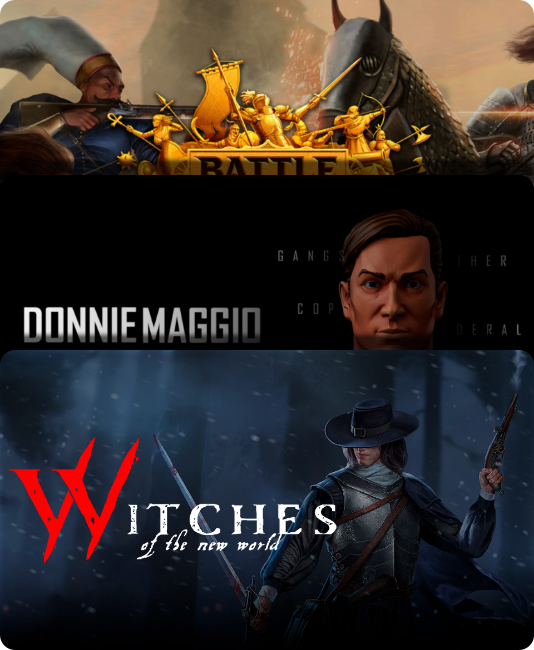
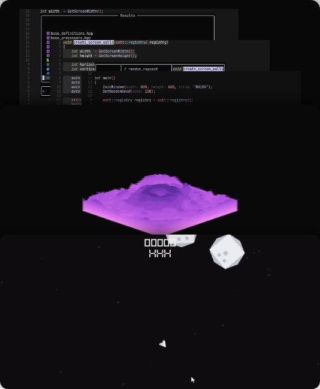

  

    
  

  

    

      I’m Daniel López, a dedicated game developer with strong interest in gameplay and AI programming.
      I’m passionate about learning and continuously evolving my abilities. I thrive on expanding my skill set and exploring new concepts.
      You can find some of my projects on: 
    

    
    
  

  

    <h2><a href="1724284122-PHVP-professional_projects" target="_self">professional projects</a></h2>
  

  

  

    <h2><a href="1724306122-EEMH-personal_projects" target="_self">personal projects</a></h2>
  

  

