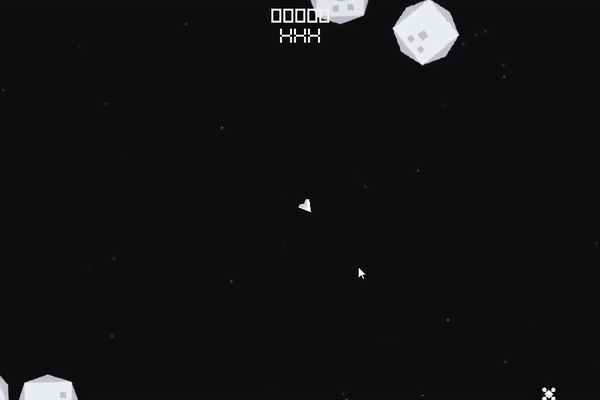
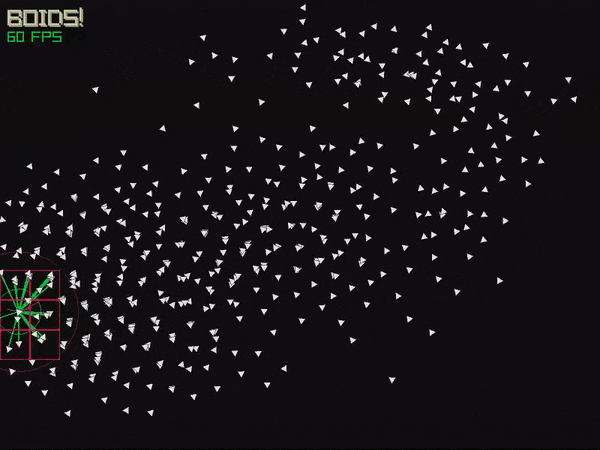
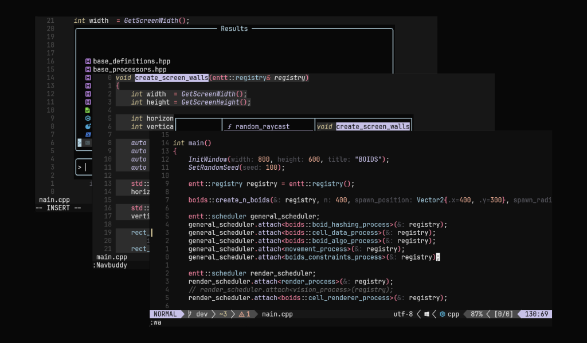

  
  

    <h2><a href="https://github.com/DanielEliasib/entt_asteroids" target="_blank">entt_asteroids</a></h2>
    
A native C++ asteroids prototype following the principles of ECS using the Entt library and the Raylib library for rendering.

    

      ECS
      Boids
      C++
      Entt
      Raylib
    

  

  
  

    <h2><a href="https://github.com/DanielEliasib/NOISE" target="_blank">NOISE</a></h2>
    
A music visualizer for windows, made with Unity.

    
Real time sound wave analysis with real time computer shader based noise calculation for the visualization of the sound data.

    

      Unity
      Compute shader
      Parallel programming
      C#
    

  

  
  

    <h2><a href="https://github.com/DanielEliasib/Boids" target="_blank">Boids</a></h2>
    
A parallel implementation of the boids algorithm in Unity.

    
Using the Unity Job System to manage a big quantyty of boids.

    

      Unity
      Unity Job system
      Parallel programming
      Boids
      C#
    

  

  
  

    <h2><a href="https://github.com/DanielEliasib/entt_boids" target="_blank">entt_boids</a></h2>
    
A native C++ implementation of the boids algorithm following the principles of ECS using the Entt library and the Raylib library for rendering.

    

      ECS
      Boids
      C++
      Entt
      Raylib
    

  

  
  

    <h2><a href="https://github.com/DanielEliasib/sweet-fusion" target="_blank">sweet-fusion</a></h2>
    
A neoVim colorscheme supporting several popular plugins made in Lua.

    
Small side project to support a tool I use daily, neovim.

    

      Lua
      Colorscheme
      Neovim
    

  

