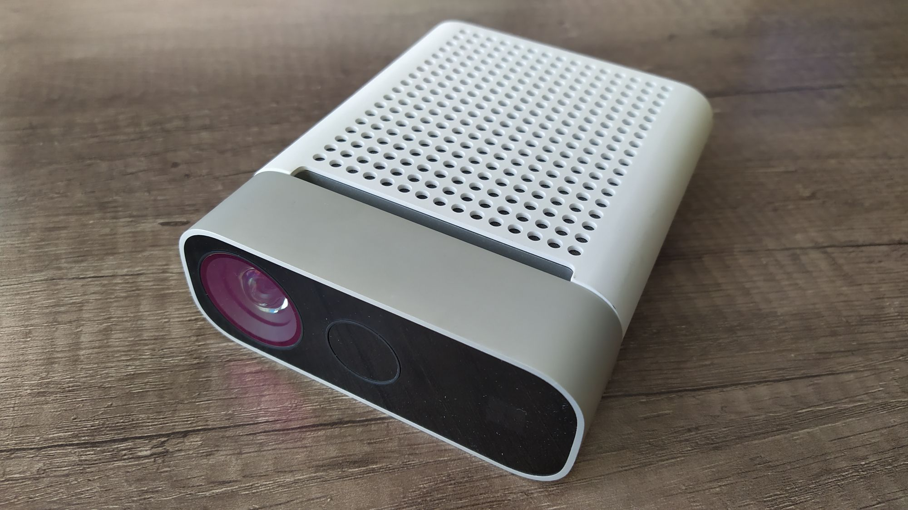

# Main problem
The objective with this part of the project is to be able to load the Azure Kinect SDK from within an Unreal Engine plugin.

I thought it would be easy to load a third-party library in the Unreal solution, but it’s not as straight forward as I thought, in the end I found two ways that do not involve copying the source code, nor making a wrapper around your third-party library to be able to manipulate it.

## The plugin
I added an empty plugin to my project called *AzureKinect*, this will create you:

- `AzureKinect.Build.cs`
- AzureKinect module with `AzureKincet.cpp` and `AzureKinect.h`

In **AzureKinect.Build.cs** we need to add the path to the include folders of the SDK, and the path to the lib files.

After this we have two options:

- Add the *.dlls* to `PublicDelayLoadDLLs`
- Add the *.dlls* to `RuntimeDependencies`

The first option will give you the option of loading the *.dlls* manually at the point where you need them, this option gives you more control, but the engine will crash if you do not load the *.dlls* on time.

The second option will let you copy the *.dlls* files from the SDK to the binaries folder of the plugin. This is the most hands off solution, Unreal will load the *.dlls* when loading the module, and will look in binaries for the *.dlls*, that’s why it’s important to copy the files, at least in my experience.

## Example
The main examples for what I described above can be found on the following gist:

<a href="https://gist.github.com/DanielEliasib/e12165f4260059b0cdeee096a9079e2f" style="display: inline-block; padding: 10px 20px; border: 2px solid var(--secondary); border-radius: 10px; text-decoration: none; color: var(--secondary); text-align: center;">
    View Gist
</a>

> [!note]
> This project is paused indefinitely because I lost access to the Azure Kinect I was experimenting with, sadly I didn't get much further than this.
